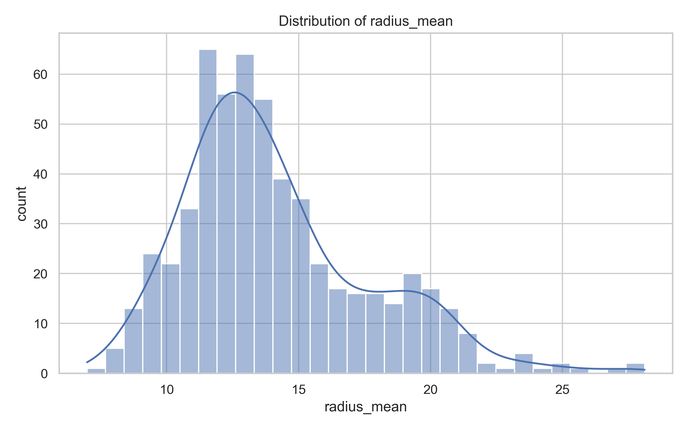

# Gene Expression Data Visualisation Project

##  Overview
This project explores gene expression data from breast cancer samples provided by Kaggle.  
It uses **Python (pandas, matplotlib, seaborn)** to create visualisations that highlight biological differences between **benign** and **malignant** tumours.  

The aim is to bridge my **Biotechnology background** with the **data skills** I developed in my Year in Computer Science, creating a portfolio project that blends biology and coding.

---

## Project Goals
- Clean and process raw gene expression data  
- Produce clear, interpretable visualisations  
- Link statistical patterns to biological insights  
- Showcase coding, data handling, and scientific communication skills

---

## Tools Used
- **Python 3**  
- **pandas** for data manipulation  
- **matplotlib & seaborn** for plotting  

---

## Outputs
The `results/` folder contains generated figures:
1. **Histogram** – Distribution of nucleus radius across all samples
   
3. **Boxplot** – Mean nuclear area by diagnosis (Benign vs Malignant)  
4. **Bar Chart** – Top-10 features most correlated with malignancy  
5. **Scatter Plot** – Radius vs Texture, coloured by diagnosis  

---

## Biological Insights
- Malignant tumours often have **larger and more variable nuclei**  
- Nuclear **area and shape irregularity** are strong markers of cancer progression  
- Combining features like **radius** and **texture** can help distinguish tumour types  
- These findings align with pathology principles used in diagnostics  

**Cell size and cancer**:
The radius_mean distribution shows that malignant tumours often have larger and more variable cell nuclei compared to benign ones. This reflects how cancer cells lose normal growth control and develop irregular structures.

**Nuclear area differences**:
The boxplot of area_mean confirms this: malignant cells typically occupy more area, which is consistent with pathology observations in breast cancer diagnostics.

**Feature correlations with malignancy**:
The correlation analysis highlights which nuclear features are most strongly associated with cancer progression. For example, measures of compactness, concavity, and perimeter are among the top correlated features. These reflect how malignant nuclei tend to have irregular, jagged shapes.

**Feature interactions**:
The scatterplot of radius_mean vs texture_mean shows a clear separation between benign and malignant samples. This suggests that combining size (radius) with structural irregularity (texture) provides strong predictive power - the same principle behind diagnostic scoring systems used by pathologists.

---

## How to Run
1. Clone/download this repository  
2. Open the Jupyter Notebook (`notebook.ipynb`)  
3. Run all cells to generate figures  
4. Outputs will be saved in the `results/` folder  

---

## Why This Project Matters
This project demonstrates my ability to:
- Work with **biological datasets**  
- Apply **coding & data visualisation** to real problems  
- Communicate results in both **technical and biological terms**

It’s part of my portfolio as I prepare to apply for graduate roles. 

---
